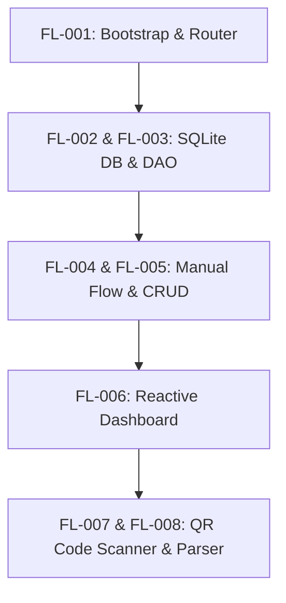

# Documentação de Produto & Engenharia: FlyLedger

FlyLedger é um gerenciador de despesas financeiras pessoais moderno, projetado sob a filosofia **Local-First (Offline-First)**. Este documento apresenta a visão geral do projeto, sua jornada de desenvolvimento, arquitetura de engenharia, estado atual, roadmap técnico e a estratégia de produto para torná-lo uma solução digna de prêmio (Award-Winning Product).

---

## 1. Visão Geral e Filosofia do Projeto

A maioria dos aplicativos de finanças pessoais atuais sofre de três problemas fundamentais:
1. **Fricção excessiva na entrada de dados:** O usuário precisa preencher manualmente valores, datas, categorias e nomes de lojas.
2. **Dependência de conexão (Online-Only):** Telas de carregamento lentas ao abrir o app em trânsito ou sem sinal de rede.
3. **Falta de privacidade:** Dados bancários e padrões de gastos pessoais armazenados de forma desprotegida ou vendidos por grandes corporações SaaS.

O **FlyLedger** nasceu para redefinir esse paradigma utilizando quatro pilares fundamentais:

*   **Local-First:** O banco de dados (SQLite) vive inteiramente no dispositivo do usuário. A leitura e gravação de despesas são instantâneas (< 2ms) e funcionam em 100% dos cenários offline.
*   **Captura Inteligente Multi-Modal:** Entrada de despesas facilitada por leitura de QR Code fiscal e, no futuro, OCR local de recibos físicos.
*   **Fricção Zero:** O app extrai dados automaticamente de fontes brutas (URL da nota fiscal, texto da imagem) e preenche os campos para o usuário apenas revisar e salvar.
*   **Privacidade Absoluta:** O controle dos dados pertence unicamente ao usuário. Qualquer sincronização futura com a nuvem deve ser criptografada de ponta a ponta.

---

## 2. Linha do Tempo de Desenvolvimento e Estado Atual

O desenvolvimento do FlyLedger foi estruturado em épicos incrementais e rigorosamente controlados (de `FL-001` a `FL-008`), garantindo a integridade da base de dados e a qualidade da experiência do usuário.



### Detalhamento das Etapas Concluídas

#### 📦 FL-001: Bootstrap e Fundações do App
*   Criação da estrutura base com **Expo** e **TypeScript**.
*   Configuração do roteamento baseado em arquivos com **Expo Router** (estrutura modular em `/app` e layouts organizados em abas `(tabs)`).

#### 🗄️ FL-002 & FL-003: Arquitetura de Banco de Dados Local-First (SQLite)
*   Implementação do `DBManager` centralizado (`src/db/database.ts`) garantindo conexão única e reativa.
*   Criação do schema estrito no SQLite (`src/db/init.ts`) com constraints relacionais (`FOREIGN KEY` com `ON DELETE CASCADE` e `ON DELETE RESTRICT`) e restrições de domínio (`CHECK constraints`).
*   Preenchimento inicial automático de categorias (`src/db/seed.ts`) com ícones e cores dedicadas.

#### ✍️ FL-004 & FL-005: Fluxo Manual e Mecanismo de CRUD
*   Estruturação da tabela `CaptureRecord` para gerenciar a origem de cada dado financeiro (Manual, QR Code ou Imagem).
*   Implementação do fluxo manual de inserção de despesas.
*   Criação da tela de **Review** (`app/review.tsx`) que serve como interface de validação antes de transformar um registro bruto em uma despesa efetiva (`Expense`).
*   Implementação de edição e descarte lógico/físico no SQLite, operando transações ACID via DAO (`src/db/queries.ts`).

#### 📊 FL-006: Dashboard Reativo Real
*   Listagem de despesas ordenadas na aba Home (`app/(tabs)/index.tsx`).
*   Uso do hook de ciclo de vida `useFocusEffect` integrado ao SQLite para garantir atualização instantânea da interface sem necessidade de reload manual do aplicativo.

#### 🔲 FL-007 & FL-008: Scanner e Parser de QR Code Fiscal
*   Integração da câmera nativa via `expo-camera` em `app/scan-qr.tsx`.
*   Desenvolvimento do parser offline de URLs fiscais do SEFAZ (`src/utils/qrParser.ts`). O app analisa a query string da URL para extrair de forma nativa o valor total (`vNF`, `val`) e a data da transação (`dhEmi`, `data`).
*   Implementação dos estados `CaptureRecordStatus` (`captured` ➡️ `normalized` ➡️ `extracted` ➡️ `pending_review` ➡️ `validated`).
*   Desenvolvimento do histórico de auditoria via `ProcessingSnapshot`, armazenando metadados de confiança das sugestões sem quebrar ou alterar o schema relacional padrão.
*   Tratamento avançado de avisos (warnings) na tela de Review para os casos em que o QR code capturado não possui informações financeiras expostas na URL (ex: chaves de acesso puras), instruindo o usuário a digitar manualmente o valor, mas mantendo a associação com o registro fiscal original.

---

## 3. Arquitetura de Dados e Ciclo de Vida da Despesa

O banco de dados relacional foi planejado para isolar os dados brutos capturados das despesas reais validadas. Isso impede que capturas com erro poluam o fluxo financeiro principal do usuário.

```
                    ┌───────────────────────────────────────────┐
                    │               CaptureRecord               │
                    │   id, capture_type, captured_at, status   │
                    └─────────────────────┬─────────────────────┘
                                          │
                   ┌──────────────────────┴──────────────────────┐
                   ▼                                             ▼
     ┌───────────────────────────┐                 ┌───────────────────────────┐
     │    ProcessingSnapshot     │                 │          Expense          │
     │ processed_at, suggested_* │                 │ category_id, amount, date │
     │ normalized_text, warnings │                 │ merchant_name, desc       │
     └───────────────────────────┘                 └───────────────────────────┘
```

### Ciclo de Estados do Registro de Captura (`CaptureRecordStatus`)

1.  `captured`: O QR code foi lido pela câmera ou a foto do cupom foi tirada.
2.  `normalized`: O payload bruto foi sanitizado e padronizado.
3.  `extracted`: Heurísticas rodaram locais e as sugestões de valores foram geradas.
4.  `pending_review`: O registro está pronto para validação do usuário.
5.  `validated`: O usuário aprovou e os dados foram inseridos atomicamente na tabela `Expense`.
6.  `discarded` ou `failed`: O registro foi rejeitado pelo usuário ou falhou no processamento.

---

## 4. Próximos Passos (Next Steps) de Engenharia

Para evoluir a fundação técnica robusta que construímos, o roadmap de engenharia deve focar nas seguintes integrações e recursos locais:

### 1. OCR Local de Recibos Físicos (FL-009)
*   **Objetivo:** Permitir a leitura de cupons de papel que não possuem QR Code.
*   **Abordagem:** Utilizar o Google ML Kit Text Recognition (ou TensorFlow Lite embarcado) para extrair o texto completo do cupom localmente.
*   **Heurísticas:** Regex avançados rodando em uma thread secundária para identificar palavras-chave como `Total`, `Valor`, `R$`, CNPJ e datas.

### 2. Sincronização Local-First Bidirecional e Backup
*   **Objetivo:** Permitir que o usuário acesse seus dados em múltiplos dispositivos sem perder a propriedade deles.
*   **Abordagem:** Implementação de protocolo de sincronização baseado em CRDTs (Conflict-free Replicated Data Types) ou sync incremental nativo. O banco de dados SQLite local enviará deltas assinados e criptografados para uma nuvem pessoal (como iCloud, Google Drive ou servidor self-hosted via WebDav/Supabase).

### 3. Modelo de Categorização Inteligente Local (On-Device ML)
*   **Objetivo:** Classificar automaticamente despesas novas com base no nome do estabelecimento.
*   **Abordagem:** Treinar um classificador Naive Bayes ou usar um modelo de linguagem leve embarcado (ex: MobileBERT) rodando direto no dispositivo. O modelo aprende com os hábitos de categorização do usuário em tempo real.

### 4. Dashboards Interativos Avançados
*   **Objetivo:** Proporcionar análises profundas de saúde financeira.
*   **Abordagem:** Utilizar a biblioteca `react-native-wagmi-charts` ou `Victory Native` acopladas a queries agregadoras de alta performance (`SQL GROUP BY` por data/categoria) para exibir gráficos de linha, barras e pizza fluidos a 120 FPS.

---

## 5. Como Tornar o FlyLedger um Produto Digno de Prêmio

Para transformar o FlyLedger de um excelente utilitário em um produto premium de destaque internacional, devemos focar em **estética visual impecável, performance extrema e inovações radicais em experiência de usuário (UX)**.

### A. Design System Premium e Estética Fluida
*   **Paleta de Cores Curada (HSL Dinâmico):** Substituir cores padrão por gradientes suaves e tons harmônicos de HSL ajustados para suportar Dark Mode e Light Mode nativos e elegantes.
*   **Glassmorphism e Neumorphism Sutil:** Elementos de interface com sensação de profundidade física, utilizando borrões de fundo em tempo real (`expo-blur`) e sombras suaves.
*   **Micro-animações Orgânicas:** Toda interação deve ter resposta visual instantânea. Utilizar `react-native-reanimated` com física de mola (*spring physics*) para transições de tela, abertura de modais e reordenação de itens na lista.
*   **Feedback Hático Sensorial:** Integração precisa de `expo-haptics`. O usuário deve "sentir" o clique ao salvar uma despesa, um leve toque tátil ao ler um QR Code com sucesso e uma vibração sutil em caso de aviso.

### B. Performance Extrema (Zero-Lag UX)
*   **Listas a 120 FPS com FlashList:** Migração de FlatList para `@shopify/flash-list`, garantindo rolagem extremamente suave mesmo com milhares de despesas salvas no histórico.
*   **Leituras Assíncronas de Baixa Latência:** Uso do SQLite nativo integrado via drivers JSI para evitar bloqueios na thread principal de renderização do React Native.
*   **Scuba Mode Camera:** A câmera do scanner QR deve possuir um modo inteligente que auto-detecta cupons e códigos fiscais através de visão computacional em tempo real, realizando o foco e a captura instantaneamente sem que o usuário precise apertar botões ou alinhar perfeitamente o celular.

### C. Recursos de Produto Inovadores e Disruptivos

#### 1. "Zero Friction Setup" (Instant-On)
O aplicativo não deve exigir login, e-mail ou criação de conta para começar. Ao abrir o app pela primeira vez, o banco SQLite local é iniciado instantaneamente e o usuário já pode escanear ou digitar uma despesa. A criação de conta e sincronização tornam-se opcionais para backup, garantindo a privacidade e eliminando a barreira de entrada.

#### 2. Widgets de Sistema Interativos (iOS e Android)
Criação de widgets nativos para a tela inicial do aparelho:
*   Um botão de atalho de um clique para abrir a Câmera diretamente no scanner de QR Code.
*   Exibição do orçamento mensal restante com atualizações silenciosas em background acionadas por mudanças no banco de dados.

#### 3. Integração Híbrida Open Finance Privada
Permitir que o usuário vincule suas contas bancárias via Open Finance localmente. O aplicativo lê os extratos bancários locais (ou via notificações do celular) e faz a conciliação inteligente cruzando valores e datas com os QR Codes e recibos capturados pela câmera. Em caso de correspondência, ele anexa a nota fiscal à transação bancária automaticamente.

#### 4. Assistente de IA de Privacidade Máxima (On-Device LLM)
Utilizar a tecnologia de modelos LLM locais adaptados para dispositivos móveis (como LLaMA 3 ou Gemma executados localmente via MediaPipe). O usuário pode conversar em linguagem natural com suas finanças ("Quanto eu gastei com lazer essa semana?", "Crie uma meta para eu economizar R$ 500 no próximo mês") sem que um único dado saia do seu dispositivo físico, unindo inteligência de ponta com segurança absoluta.

#### 5. Ledger Compartilhado com Criptografia de Ponta a Ponta (E2EE)
Permitir que casais ou equipes gerenciem orçamentos compartilhados de forma descentralizada. As transações locais de cada dispositivo são criptografadas localmente com chaves privadas antes de serem propagadas pela rede, impossibilitando que terceiros leiam os dados financeiros no servidor de sincronização intermediário.

---

### Conclusão

O FlyLedger já possui a espinha dorsal de um aplicativo excepcional de finanças: banco local rápido, arquitetura modular e captura facilitada. Ao expandir para OCR local, adicionar um polimento de design premium digno de premiações de design (Apple Design Awards / Google Play Best Apps) e manter o compromisso intransigente com a privacidade do usuário, o FlyLedger tem o potencial de redefinir o mercado de gestão financeira pessoal móvel.
