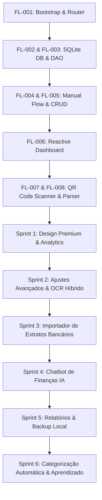

# Documentação de Produto & Engenharia: FlyLedger

FlyLedger é um gerenciador de despesas financeiras pessoais moderno, projetado sob a filosofia **Local-First (Offline-First)**. Este documento apresenta a visão geral do projeto, sua jornada de desenvolvimento, arquitetura de engenharia, estado atual, roadmap técnico e a estratégia de produto para torná-lo uma solução digna de prêmio (Award-Winning Product).

---

## 1. Visão Geral e Filosofia do Projeto

A maioria dos aplicativos de finanças pessoais atuais sofre de três problemas fundamentais:
1. **Fricção excessiva na entrada de dados:** O usuário precisa preencher manualmente valores, datas, categorias e nomes de lojas.
2. **Dependência de conexão (Online-Only):** Telas de carregamento lentas ao abrir o app em trânsito ou sem sinal de rede.
3. **Falta de privacidade:** Dados bancários e padrões de gastos pessoais armazenados de forma desprotegida ou vendidos por grandes corporações SaaS.

O **FlyLedger** nasceu para redefinir esse paradigma utilizando quatro pilares fundamentais:

*   **Local-First:** O banco de dados (SQLite) vive inteiramente no dispositivo do usuário. A leitura e gravação de despesas são instantâneas (< 2ms) e funcionam em 100% dos cenários offline.
*   **Captura Inteligente Multi-Modal:** Entrada de despesas facilitada por leitura de QR Code fiscal, OCR local/híbrido de recibos físicos e importação de extratos de múltiplos bancos.
*   **Fricção Zero:** O app extrai dados automaticamente de fontes brutas (URL da nota fiscal, texto da imagem, extratos bancários) e preenche os campos para o usuário apenas revisar e salvar.
*   **Privacidade Absoluta:** O controle dos dados pertence unicamente ao usuário. A IA opera com suporte a modelos locais offline (Ollama/Langflow) e a exportação e importação de backups são 100% locais.

---

## 2. Linha do Tempo de Desenvolvimento e Estado Atual

O desenvolvimento do FlyLedger foi estruturado em épicos incrementais e rigorosamente controlados (de `FL-001` a `FL-029`), garantindo a integridade da base de dados e a qualidade da experiência do usuário.



### Detalhamento das Etapas Concluídas

#### 📦 FL-001: Bootstrap e Fundações do App
*   Criação da estrutura base com **Expo** e **TypeScript**.
*   Configuração do roteamento baseado em arquivos com **Expo Router** (layout modular em `/app` e layouts organizados em abas `(tabs)`).

#### 🗄️ FL-002 & FL-003: Arquitetura de Banco de Dados Local-First (SQLite)
*   Implementação do `DBManager` centralizado (`src/db/database.ts`) garantindo conexão única e reativa.
*   Criação do schema estrito no SQLite (`src/db/init.ts`) com constraints relacionais (`FOREIGN KEY` com `ON DELETE CASCADE` e `ON DELETE RESTRICT`) e restrições de domínio (`CHECK constraints`).
*   Preenchimento inicial automático de categorias (`src/db/seed.ts`) com ícones e cores dedicadas.

#### ✍️ FL-004 & FL-005: Fluxo Manual e Mecanismo de CRUD
*   Estruturação da tabela `CaptureRecord` para gerenciar a origem de cada dado financeiro (Manual, QR Code ou Imagem).
*   Implementação do fluxo manual de inserção de despesas.
*   Criação da tela de **Review** (`app/review.tsx`) que serve como interface de validação antes de transformar um registro bruto em uma despesa efetiva (`Expense`).
*   Implementação de edição e descarte lógico/físico no SQLite, operando transações ACID via DAO (`src/db/queries.ts`).

#### 📊 FL-006: Dashboard Reativo Real
*   Listagem de despesas ordenadas na aba Home (`app/(tabs)/index.tsx`).
*   Uso do hook de ciclo de vida `useFocusEffect` integrado ao SQLite para garantir atualização instantânea da interface sem necessidade de reload manual do aplicativo.

#### 🔲 FL-007 & FL-008: Scanner e Parser de QR Code Fiscal
*   Integração da câmera nativa via `expo-camera` em `app/scan-qr.tsx`.
*   Desenvolvimento do parser offline de URLs fiscais do SEFAZ (`src/utils/qrParser.ts`). O app analisa a query string da URL para extrair de forma nativa o valor total (`vNF`, `val`) e a data da transação (`dhEmi`, `data`).
*   Implementação dos estados `CaptureRecordStatus` (`captured` ➡️ `normalized` ➡️ `extracted` ➡️ `pending_review` ➡️ `validated`).
*   Desenvolvimento do histórico de auditoria via `ProcessingSnapshot`, armazenando metadados de confiança das sugestões sem quebrar ou alterar o schema relacional padrão.
*   Tratamento avançado de avisos (warnings) na tela de Review para os casos em que o QR code capturado não possui informações financeiras expostas na URL (ex: chaves de acesso puras), instruindo o usuário a digitar manualmente o valor, mas mantendo a associação com o registro fiscal original.

#### 🎨 Sprint 1: Design Premium & Analytics
*   **FL-010: Migração de FlatList para FlashList na Home:** Substituição do scroll de despesas por `@shopify/flash-list` para renderização fluida de grandes volumes de dados a 120 FPS.
*   **FL-011: Design System Dark Slate & HSL Dinâmico:** Redesenho completo da interface usando fundo Slate escuro elegante (`#0B0F19`), inputs estilizados em `#1E293B` e chips que utilizam as cores HSL registradas no SQLite.
*   **FL-012: Dashboard Interativo SVG na aba Analytics:** Gráfico de rosca dinâmico com SVG nativo (`react-native-svg`), evolução financeira mensal em barras flexíveis e legenda dinâmica baseada no banco local.
*   **FL-013: Feedback Háptico na confirmação de Despesas:** Integração fina de `expo-haptics` para feedbacks tácteis instantâneos durante a seleção de categorias e ao salvar/descartar despesas.

#### ⚙️ Sprint 2: Ajustes Avançados & OCR Híbrido
*   **FL-014: Tabela de Configurações no SQLite:** Introdução da tabela `Settings` para preferências locais, incluindo a IA ativa (Manual, Gemini, Ollama, Langflow), chaves de API e caminhos IP locais.
*   **FL-015: Tela de Ajustes Avançados (Tab):** Desenvolvimento da aba `adjusts.tsx` com painel responsivo, campos reativos condicionais aos motores de IA e salvamento dinâmico tátil.
*   **FL-016: Captura de Fotos do Recibo:** Criação de `scan-receipt.tsx` integrada com a câmera nativa do celular para registrar capturas do tipo `IMAGE`.
*   **FL-017: Conversão em Base64 & OCR Híbrido:** Criação de `ocrService.ts` operando via `expo-file-system` para carregar fotos em base64 e despachar requisições estruturadas JSON ao Gemini ou a servidores Ollama locais (ex: `llama3.2-vision`).

#### 🏦 Sprint 3: Importador de Extratos Bancários
*   **FL-018: Integração com Document Picker:** Instalação e uso de `expo-document-picker` na aba de importação para carregar arquivos de extrato CSV/OFX locais.
*   **FL-019: Parser de Extratos Locais (OFX/CSV):** Utilitário `bankParser.ts` configurado para ler e normalizar faturas e extratos offline de bancos brasileiros populares: C6 Bank, Inter, Santander, BTG Pactual e Bradesco.
*   **FL-020: Fila de Transações Pendentes (Deck na Home):** Deck horizontal de cards premium no topo da aba Home que lista transações importadas que requerem conciliação.

#### 💬 Sprint 4: Chatbot de Finanças IA
*   **FL-021: Estatísticas de Contexto do Chat:** Função `getChatContextStats` em `queries.ts` que computa agregados do último mês (totais, limites, maiores gastos) sem expor despesas brutas individuais.
*   **FL-022: Interface de Conversação do Chat IA:** Tela em `app/(tabs)/chat.tsx` fornecendo bolhas de chat de alta fidelidade visual, pílulas de atalho para perguntas rápidas, animação de digitação e feedback tátil ao interagir.
*   **FL-023: Integração Híbrida Multimotor:** Utilitário `chatService.ts` que encapsula as chamadas de API direcionando a conversa ao motor ativo configurado pelo usuário.

#### 💾 Sprint 5: Relatórios & Backup Local
*   **FL-024: Planilha CSV estruturada para Excel:** Algoritmo que exporta as despesas injetando o cabeçalho BOM UTF-8 (`\uFEFF`) e delimitando por ponto e vírgula, permitindo abertura direta no Excel brasileiro sem corromper caracteres.
*   **FL-025: Exportação e Restauração de Backups JSON:** Lógica ACID transacional SQLite (`BEGIN/COMMIT/ROLLBACK`) para gerar e restaurar backups completos contendo tabelas de despesas, categorias, configurações e registros brutas de captura.
*   **FL-026: Compartilhamento Nativo com Compartilhar e Picker:** Integração do seletor nativo e da folha de compartilhamento do celular via `expo-sharing` e `expo-document-picker`.

#### 🧠 Sprint 6: Categorização Automática & Aprendizado
*   **FL-027: Tabela MerchantRules no SQLite:** Criação da tabela `MerchantRule` para armazenar padrões locais de estabelecimentos associados a categorias e coluna `suggested_category_id` na tabela `ProcessingSnapshot`.
*   **FL-028: Serviço Híbrido de Predição de Categoria:** Módulo `categorizationService.ts` que busca padrões Regex locais no SQLite e, caso ausentes, dispara a IA para classificar o estabelecimento de forma transparente.
*   **FL-029: Feedback Loop de Aprendizado no Review:** A tela `app/review.tsx` escuta correções manuais do usuário. Se a categoria selecionada diferir da sugestão inicial, uma nova regra `MerchantRule` é gravada no SQLite automaticamente.

---

## 3. Arquitetura de Dados e Ciclo de Vida da Despesa

O banco de dados relacional foi planejado para isolar os dados brutos capturados das despesas reais validadas. Isso impede que capturas com erro poluam o fluxo financeiro principal do usuário.

```
                    ┌───────────────────────────────────────────┐
                    │               CaptureRecord               │
                    │   id, capture_type, captured_at, status   │
                    └─────────────────────┬─────────────────────┘
                                          │
                    ┌─────────────────────┴──────────────────────┐
                    ▼                                            ▼
      ┌───────────────────────────┐                ┌───────────────────────────┐
      │    ProcessingSnapshot     │                │          Expense          │
      │ processed_at, suggested_* │                │ category_id, amount, date │
      │ normalized_text, warnings │                │ merchant_name, desc       │
      │   suggested_category_id   │                └───────────────────────────┘
      └───────────────────────────┘
```

### Esquema do Banco de Dados Relacional (SQLite)

1.  **Category:** Tabela de categorias (ex: Alimentação, Transporte, Lazer) com ícones, cores HSL e flag de status.
2.  **CaptureRecord:** Registro bruto do input financeiro (Manual, QR Code ou Imagem). Controla o ciclo de estados através da coluna `status`.
3.  **ProcessingSnapshot:** Armazena os dados extraídos preliminarmente, incluindo as confianças (HIGH, MEDIUM, LOW) das extrações e a sugestão inteligente de categoria (`suggested_category_id`).
4.  **Expense:** O registro financeiro real e consolidado, utilizado nos relatórios de Analytics. Mantém uma referência para o `CaptureRecord` de origem e a `Category` correspondente.
5.  **Settings:** Configurações chave-valor locais do usuário (tipo de IA, chaves, URLs de servidores Ollama/Langflow).
6.  **MerchantRule:** Regras aprendidas localmente ligando padrões de estabelecimentos (ex: `%uber%`) a categorias específicas.

---

## 4. Próximos Passos (Next Steps) de Engenharia

Para evoluir a fundação técnica robusta que construímos, os próximos sprints de engenharia focarão nas seguintes evoluções:

### 1. Sincronização Incremental E2EE (iCloud / Google Drive)
*   **Objetivo:** Permitir sincronização segura multi-dispositivo sem banco de dados centralizado que viole a privacidade.
*   **Abordagem:** Exportação de deltas compactados e criptografados localmente com chave derivada de senha do usuário, persistidos diretamente na conta pessoal do usuário na nuvem (iCloud Drive ou Google Drive).

### 2. Carteiras e Orçamentos Compartilhados (Shared Ledgers)
*   **Objetivo:** Gerenciar finanças em casal ou equipes.
*   **Abordagem:** Utilização de CRDTs (Conflict-free Replicated Data Types) locais para resolver conflitos de alteração concorrente em bancos de dados distribuídos via conexões seguras peer-to-peer ou backups cruzados na nuvem.

### 3. Modelo de Linguagem Local Compacto (On-Device LLM)
*   **Objetivo:** Eliminar requisições a APIs de terceiros para o chatbot e categorizador.
*   **Abordagem:** Embarcar e rodar modelos compactos (ex: Gemma 2B ou Qwen 1.5B) diretamente no celular usando MediaPipe LLM Inference API, garantindo 100% de privacidade offline e zero custos de infraestrutura cloud.

### 4. Modo de Câmera "Scuba" Autônomo
*   **Objetivo:** Reduzir cliques no scanner de recibos.
*   **Abordagem:** Algoritmo de visão computacional em tempo real na câmera que detecta as bordas de cupons de papel e auto-dispara a captura instantânea quando o papel estiver centralizado e em foco estável.

---

## 5. Como Tornar o FlyLedger um Produto Digno de Prêmio

Para transformar o FlyLedger de um excelente utilitário em um produto premium de destaque internacional, devemos focar em **estética visual impecável, performance extrema e inovações em experiência de usuário (UX)**.

### A. Design System Premium e Estética Fluida
*   **Paleta de Cores Curada (HSL Dinâmico):** Substituir cores padrão por gradientes suaves e tons harmônicos de HSL ajustados para suportar Dark Mode e Light Mode nativos e elegantes.
*   **Glassmorphism e Neumorphism Sutil:** Elementos de interface com sensação de profundidade física, utilizando borrões de fundo em tempo real (`expo-blur`) e sombras suaves.
*   **Micro-animações Orgânicas:** Toda interação deve ter resposta visual instantânea. Utilizar `react-native-reanimated` com física de mola (*spring physics*) para transições de tela, abertura de modais e reordenação de itens na lista.
*   **Feedback Hático Sensorial:** Integração precisa de `expo-haptics`. O usuário deve "sentir" o clique ao salvar uma despesa, um leve toque tátil ao ler um QR Code com sucesso e uma vibração sutil em caso de aviso.

### B. Performance Extrema (Zero-Lag UX)
*   **Listas a 120 FPS com FlashList:** Migração de FlatList para `@shopify/flash-list`, garantindo rolagem extremamente suave mesmo com milhares de despesas salvas no histórico.
*   **Leituras Assíncronas de Baixa Latência:** Uso do SQLite nativo integrado via drivers JSI para evitar bloqueios na thread principal de renderização do React Native.

### C. Recursos de Produto Inovadores e Disruptivos
*   **Zero Friction Setup:** O app funciona instantaneamente sem exigir conta ou internet, minimizando qualquer barreira de entrada e priorizando a usabilidade imediata.
*   **Widgets de Sistema Interativos:** Atalhos na tela de início do celular para abrir a câmera diretamente no scanner fiscal ou exibir o orçamento consolidado do mês em tempo real.
